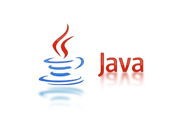

# Abstract Rest Service Benchmark

## Requirements

* PORT: `8080`

* API request: `/api/test`

* API response: `Hello, World!` *(text/plain, UTF-8, 13 bytes)*

## Benchmark

Command for [WRK](https://github.com/wg/wrk):

```bash
$ wrk -t8 -c512 -d2m --timeout 10s --latency http://localhost:8080/api/test
```

---

## Results

| # | Service | Language | Framework | RPS |
| - | ------- | -------- | --------- | --- |
|  | [.Net Core](/dot-net-core/) | C# | dotnet 2.1.4 | TBD |
|  | [.Net Core ASP.NET MVC](/dot-net-core-asp-net/) | C# | dotnet 2.1.4 | TBD |
|  | [.Net Core Websocket](/dot-net-core-websocket/) | C# | dotnet 2.1.4 + websocket | TBD |
|  | [.Net Core Freya](/dot-net-core-freya/) | F# | dotnet 2.1.4 + freya-hopac | TBD |
|  | [.Net Core Giraffe](/dot-net-core-giraffe/) | F# | dotnet 2.1.4 + giraffe | TBD |
|  | [Go Gorilla/Mux](/go-gorilla-mux/) | Golang | go sdk 1.9.4 + gorilla/mux | TBD |
|  | [Haskell Warp](/haskell-warp/) | Haskell | ghc 7.10.3 + warp | TBD |
|  | [Java Light 4J](/java-light-4j/) | Java | oracle jdk 9.0.4 + ligth4j | TBD |
|  | [Java Spring Boot](/java-spring-boot/) | Java | oracle jdk 9.0.4 + spring boot | TBD |
|  | [NodeJS](/nodejs/) | JavaScript | nodejs 8.9.4 | TBD |
|  | [NodeJS Express](/nodejs-express/) | JavaScript | nodejs 8.9.4 + express | TBD |
|  | [Python Aiohttp](/python-aiohttp/) | Python | python 3.5.2 + aiohttp | TBD |
|  | [Python API Star](/python-apistar/) | Python | python 3.5.2 + apistar | TBD |
|  | [Python Flask](/python-flask/) | Python | python 3.5.2 + flask | TBD |
|  | [Python Sanic](/python-sanic/) | Python | python 3.5.2 + sanic| TBD |
|  | [Rust Iron](/rust-iron/) | Rust | rust 1.24.1 + iron | TBD |
|  | [Rust Rocket](/rust-rocket/) | Rust | rust 1.24.1 + rocket | TBD |

---

## Services


### .Net Core by [@vanbukin](https://github.com/vanbukin)

Language: C#

Framework: .Net Core 2

Run:

```bash
$ dotnet restore
$ dotnet publish -c Release
$ export ASPNETCORE_ENVIRONMENT=Production
$ export ASPNETCORE_URLS=http://0.0.0.0:8080
$ cd ./dotNetCoreRestService/bin/Release/netcoreapp2.0/publish
$ dotnet dotNetCoreRestService.dll
```

Result:

```text
TBD
```

---

### .Net Core ASP.NET MVC by [@binakot](https://github.com/binakot)

Language: C#

Framework: .Net Core 2, ASP.NET MVC

Main tutorial: https://docs.microsoft.com/en-us/aspnet/core/tutorials/first-web-api

Run:

```bash
$ dotnet restore
$ dotnet publish -c Release
$ export ASPNETCORE_ENVIRONMENT=Production
$ export ASPNETCORE_URLS=http://0.0.0.0:8080
$ cd ./dotNetCoreRestService/bin/Release/netcoreapp2.0/publish
$ dotnet dotNetCoreRestService.dll
```

Result:

```text
TBD
```

---

### .Net Core Websocket by [@petriashev](https://github.com/petriashev)

Language: C#

Framework: .Net Core 2, Websocket

Run:

```bash
$ dotnet restore
$ dotnet publish -c Release
$ export ASPNETCORE_ENVIRONMENT=Production
$ export ASPNETCORE_URLS=http://0.0.0.0:8080
$ cd ./bin/Release/netcoreapp2.0/publish
$ dotnet dot-net-core-websocket.dll
```

Result:

```text
TBD
```

---

### .Net Core Freya by [@Szer](https://github.com/Szer)

Language: F#

Framework: .Net Core 2, Freya

Run:

```bash
$ dotnet restore
$ dotnet publish -c Release
$ export ASPNETCORE_ENVIRONMENT=Production
$ export ASPNETCORE_URLS=http://0.0.0.0:8080
$ cd ./bin/Release/netcoreapp2.0/publish
$ dotnet dot-net-core-hopac-freya.dll
```

Result:

```text
TBD
```

---

### .Net Core Giraffe by [@Szer](https://github.com/Szer)

Language: F#

Framework: .Net Core 2, Giraffe

Run:

```bash
$ dotnet restore
$ dotnet publish -c Release
$ export ASPNETCORE_ENVIRONMENT=Production
$ export ASPNETCORE_URLS=http://0.0.0.0:8080
$ cd ./bin/Release/netcoreapp2.0/publish
$ dotnet dot-net-core-giraffe.dll
```

Result:

```text
TBD
```

---


### Go Gorilla/Mux by [@binakot](https://github.com/binakot)

Language: Go

Framework: Go SDK, Gorilla/Mux

Main tutorial: https://www.codementor.io/codehakase/building-a-restful-api-with-golang-a6yivzqdo

Run:

```bash
$ go build
$ ./go
```

Result:

```text
TBD
```

---


### Haskell Warp by [@kchugalinskiy](https://github.com/kchugalinskiy)

Language: Haskell

Framework: GHC, Warp

Main tutorial: http://taylor.fausak.me/2014/10/21/building-a-json-rest-api-in-haskell

Requirements:

* Install Haskell stack: https://docs.haskellstack.org/en/stable/README
* Install Cabal package: `cabal install Cabal-2.0.1.1`

Run:

```bash
$ stack setup
$ stack build
$ stack exec .stack-work/dist/**/build/test-exe/test-exe
```

Result:

```text
TBD
```

---



### Java Light 4J by [@0ffer](https://github.com/0ffer)

Language: Java

Framework: Oracle JDK 9, Light4J

Main tutorial: https://github.com/networknt/light-example-4j/tree/master/demo

Run:

```bash
$ mvn clean install
$ java -jar target/service-example-0.1.0.jar
```

Result:

```text
TBD
```

---

### Java Spring Boot by [@binakot](https://github.com/binakot)

Language: Java

Framework: Oracle JDK 9, Spring Boot

Main tutorial: http://spring.io/guides/gs/rest-service

Run:

```bash
$ gradle clean build
$ java -jar build/libs/java-spring-boot-rest-service-1.0-SNAPSHOT.jar
```

Result:

```text
TBD
```

---


### NodeJS by [@WilixLead](https://github.com/WilixLead)

Language: JavaScript  

Framework: Node.js

Main tutorial: https://nodejs.org/api/http.html#http_class_http_server  

Run:  

```bash
$ node ./index.js
```  

Result:

```text
TBD
```

---

### NodeJS Express by [@WilixLead](https://github.com/WilixLead)

Language: JavaScript  

Framework: Node.js, Express

Main tutorial: http://expressjs.com/en/starter/hello-world.html  

Run:  

```bash
$ npm i
$ node ./index.js
```  

Result:

```text
TBD
```

---


### Python Aiohttp by [@TyVik](https://github.com/TyVik)

Language: Python

Framework: Python 3, Aiohttp

Main tutorial: https://aiohttp.readthedocs.io/en/stable/  

Run:  

```bash
$ pip install -r requirements.txt
$ python app.py
```  

Result:

```text
TBD
```

---

### Python API Star by [@sergeibershadsky](https://github.com/sergeibershadsky)

Language: Python

Framework: Python 3, API Star

Main tutorial: https://github.com/encode/apistar

Run:

```bash
pip install -r requirements.txt
uvicorn app:app --workers=8 --bind=0.0.0.0:8080 --pid=pid
```

Results:

```text
TBD
```

---

### Python Flask by [@TyVik](https://github.com/TyVik)

Language: Python

Framework: Python 3, Flask

Main tutorial: http://flask.pocoo.org/

Run:

```bash
$ pip install -r requirements.txt
$ python app.py
```

Result:

```text
TBD
```

---

### Python Sanic by [@TyVik](https://github.com/TyVik)

Language: Python

Framework: Python 3, Sanic

Main tutorial: http://sanic.readthedocs.io/en/latest/  

Run:  

```bash
$ pip install -r requirements.txt
$ python app.py
```  

Results:

```text
TBD
```

---


### Rust Iron by [@kchugalinskiy](https://github.com/kchugalinskiy)

Language: Rust

Framework: Rust SDK, Iron

Main tutorial: https://github.com/iron/router/blob/master/examples/simple.rs

Run:  

```bash
$ cargo run --release
``` 

Result:

```text
TBD
```

---

### Rust Rocket by [@qezz](https://github.com/qezz)

Language: Rust

Framework: Rust SDK, Rocket

Main tutorial: https://rocket.rs/guide/getting-started/#hello-world

Run:

```bash
$ ROCKET_ENV=prod cargo run --release
```

Result:

```text
TBD
```

---

## Hardware

* Server (rest-service) host:

```text
TBD
```

* Client (wrk) host:

```text
TBD
```
